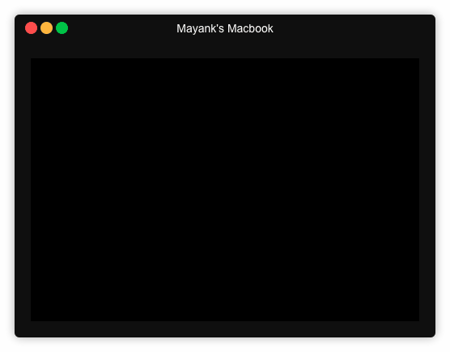

Google Photos CLI Uploader
----------------------------
Upload Google Photos in parallel faster using CLI tool

### Usage
```bash
npm install
node index.js
```

### DEMO




### Prequisites
* You need a Google API project with OAuth Credentials.
* Need to enable Google Photos API for that project
* Move `credentials.json.sample` to `credentials.json` and update the credentials accordingly.
